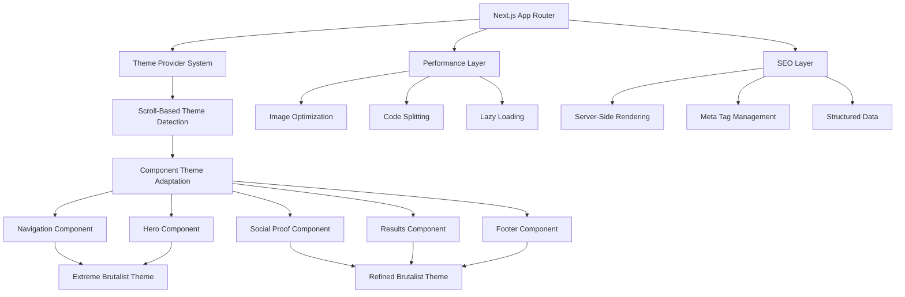
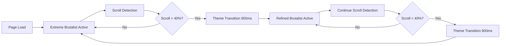

# Design Document

## Overview

This design document outlines the transformation of the existing HTML brutalist portfolio into a sophisticated Next.js 14 application featuring a dual-theme architecture. The design preserves every visual detail from the original while leveraging Next.js capabilities for enhanced performance, SEO, and modern development practices.

The architecture centers around a seamless theme transition system that evolves from **Extreme Brutalist** (aggressive, raw) to **Refined Brutalist** (professional, polished) as users scroll through the portfolio, creating a narrative journey from creative edge to business professionalism.

## Architecture

### High-Level System Architecture



### Theme Architecture Flow



### Component Hierarchy Architecture

```
src/
├── app/
│   ├── layout.tsx                 # Root layout with theme providers
│   ├── page.tsx                   # Main portfolio page
│   ├── globals.css                # Global styles and theme variables
│   └── metadata.ts                # SEO metadata configuration
├── components/
│   ├── theme/
│   │   ├── ThemeProvider.tsx      # Main theme context and state
│   │   ├── ThemeTransition.tsx    # Smooth transition animations
│   │   ├── ThemeDetector.tsx      # Scroll-based theme detection
│   │   └── ThemeRenderer.tsx      # Render props for theme-aware components
│   ├── sections/
│   │   ├── Navigation/
│   │   │   ├── Navigation.tsx     # Main navigation with dual theme support
│   │   │   ├── NavigationLogo.tsx # Logo with layered brutal effects
│   │   │   ├── NavigationMenu.tsx # Menu items with badges and indicators
│   │   │   ├── NavigationCTA.tsx  # CTA button with animations
│   │   │   └── MobileMenu.tsx     # Mobile navigation overlay
│   │   ├── Hero/
│   │   │   ├── Hero.tsx           # Hero container with background effects
│   │   │   ├── HeroContent.tsx    # Text content with typewriter effects
│   │   │   ├── HeroVisual.tsx     # Portrait and visual elements
│   │   │   ├── HeroMetrics.tsx    # Animated impact metrics
│   │   │   ├── HeroEffects.tsx    # Particle systems and backgrounds
│   │   │   └── TypewriterText.tsx # Animated text component
│   │   ├── SocialProof/
│   │   │   ├── SocialProof.tsx    # Social proof container
│   │   │   ├── ClientLogos.tsx    # Client logo carousel
│   │   │   ├── LinkedInRecommendations.tsx # Testimonial cards
│   │   │   ├── CommunityContributions.tsx  # GitHub contributions
│   │   │   ├── SpeakingEvents.tsx # Speaking timeline
│   │   │   └── Publications.tsx   # Article showcases
│   │   ├── Results/
│   │   │   ├── Results.tsx        # Results container
│   │   │   ├── ComparisonShowcase.tsx # Before/after comparisons
│   │   │   ├── RevenueDashboard.tsx   # Financial impact display
│   │   │   ├── AchievementTimeline.tsx # Career milestones
│   │   │   └── MetricsCounter.tsx # Animated counters
│   │   └── Footer/
│   │       ├── Footer.tsx         # Footer container
│   │       ├── UltimateCTA.tsx    # Final conversion section
│   │       ├── Newsletter.tsx     # Newsletter signup
│   │       ├── Resources.tsx      # Resource downloads
│   │       └── SocialPlatforms.tsx # Social media integration
│   ├── ui/
│   │   ├── BrutalButton/          # Themed button component
│   │   ├── BrutalCard/            # Themed card component
│   │   ├── BrutalInput/           # Themed form inputs
│   │   ├── AnimatedText/          # Text animation components
│   │   └── Modal/                 # Themed modal component
│   ├── effects/
│   │   ├── ParticleSystem.tsx     # Background particle effects
│   │   ├── GridBackground.tsx     # Animated grid overlays
│   │   ├── GlitchEffect.tsx       # Glitch visual effects
│   │   ├── ScanLines.tsx          # Terminal scan effects
│   │   └── CursorTrail.tsx        # Custom cursor effects
│   └── layout/
│       ├── PageTransition.tsx     # Page transition animations
│       ├── ScrollProgress.tsx     # Scroll progress indicator
│       ├── FloatingContact.tsx    # Floating contact reminder
│       └── CookieConsent.tsx      # Privacy controls
├── hooks/
│   ├── useTheme.ts                # Theme context hook
│   ├── useThemeTransition.ts      # Theme transition logic
│   ├── useScrollProgress.ts       # Scroll position tracking
│   ├── useIntersectionObserver.ts # Element visibility detection
│   ├── useAnimatedCounter.ts      # Counter animation hook
│   ├── useParallax.ts             # Parallax scroll effects
│   └── usePerformanceMonitor.ts   # Performance tracking
├── contexts/
│   ├── ThemeContext.tsx           # Theme state management
│   ├── AnimationContext.tsx       # Animation preferences
│   └── PerformanceContext.tsx     # Performance settings
├── styles/
│   ├── themes/
│   │   ├── extreme-brutalist.css  # Extreme theme styles
│   │   ├── refined-brutalist.css  # Refined theme styles
│   │   ├── theme-variables.css    # CSS custom properties
│   │   └── theme-transitions.css  # Theme transition animations
│   ├── animations/
│   │   ├── brutalist-keyframes.css # Brutalist animations
│   │   ├── hover-effects.css      # Interactive hover states
│   │   └── loading-animations.css # Loading state animations
│   └── components/
│       ├── navigation.css         # Navigation-specific styles
│       ├── hero.css               # Hero section styles
│       ├── social-proof.css       # Social proof styles
│       └── results.css            # Results section styles
├── utils/
│   ├── theme-detector.ts          # Theme detection logic
│   ├── animation-helpers.ts       # Animation utility functions
│   ├── performance-utils.ts       # Performance optimization
│   └── seo-helpers.ts             # SEO utility functions
├── types/
│   ├── theme.ts                   # Theme type definitions
│   ├── components.ts              # Component prop types
│   └── animations.ts              # Animation type definitions
└── data/
    ├── portfolio.ts               # Portfolio content data
    ├── testimonials.ts            # Testimonial data
    ├── projects.ts                # Project data
    └── skills.ts                  # Skills and technologies
```

## Components and Interfaces

### Core Theme System

#### ThemeProvider Component

```typescript
interface ThemeContextType {
  currentTheme: "extreme-brutalist" | "refined-brutalist";
  isTransitioning: boolean;
  transitionProgress: number;
  setTheme: (theme: ThemeType) => void;
  config: ThemeConfig;
}

interface ThemeConfig {
  colors: {
    bg: string;
    text: string;
    accent: string;
    secondary: string;
  };
  borders: {
    width: string;
    style: string;
    radius?: string;
  };
  shadows: {
    brutal?: string;
    subtle?: string;
  };
  animations: {
    duration: string;
    easing: string;
  };
  typography: {
    primary: string;
    code: string;
  };
}
```

#### Theme Detection Hook

```typescript
interface UseThemeTransitionOptions {
  thresholds: Array<{
    progress: number;
    theme: ThemeType;
  }>;
  transitionDuration: number;
  easing: string;
}

const useThemeTransition = (options: UseThemeTransitionOptions) => {
  const scrollProgress = useScrollProgress();
  const { setTheme, isTransitioning } = useTheme();

  // Smooth theme transition logic based on scroll position
  // Handles hysteresis to prevent rapid theme switching
  // Manages transition states and progress tracking
};
```

### Component Architecture Patterns

#### Compound Component Pattern for Complex Sections

```typescript
// Hero section using compound components
const Hero = {
  Container: ({ children, theme }: HeroContainerProps) => (
    <section className={`hero hero--${theme}`}>
      <HeroEffects theme={theme} />
      {children}
    </section>
  ),

  Content: ({ children, theme }: HeroContentProps) => (
    <div className={`hero__content hero__content--${theme}`}>{children}</div>
  ),

  Title: ({ children, theme }: HeroTitleProps) => (
    <h1 className={`hero__title hero__title--${theme}`}>
      <TypewriterText text={children} theme={theme} />
    </h1>
  ),

  Metrics: ({ metrics, theme }: HeroMetricsProps) => (
    <div className={`hero__metrics hero__metrics--${theme}`}>
      {metrics.map((metric, index) => (
        <MetricsCounter
          key={index}
          value={metric.value}
          label={metric.label}
          theme={theme}
          delay={index * 200}
        />
      ))}
    </div>
  ),
};
```

#### Theme-Aware Component Pattern

```typescript
interface BrutalButtonProps {
  children: React.ReactNode;
  variant: "primary" | "secondary" | "ghost";
  size: "sm" | "md" | "lg";
  theme?: ThemeType;
  onClick?: () => void;
  className?: string;
}

const BrutalButton: React.FC<BrutalButtonProps> = ({
  children,
  variant,
  size,
  theme,
  onClick,
  className,
}) => {
  const { currentTheme, config } = useTheme();
  const activeTheme = theme || currentTheme;

  return (
    <button
      className={`brutal-button brutal-button--${activeTheme} brutal-button--${variant} brutal-button--${size} ${className}`}
      onClick={onClick}
      style={
        {
          "--button-bg":
            variant === "primary" ? config.colors.accent : "transparent",
          "--button-text":
            variant === "primary" ? config.colors.bg : config.colors.text,
          "--button-border": `${config.borders.width} ${config.borders.style} ${config.colors.text}`,
          "--button-shadow": config.shadows.brutal || config.shadows.subtle,
          "--button-transition": `${config.animations.duration} ${config.animations.easing}`,
        } as CSSProperties
      }
    >
      <span className="brutal-button__text">{children}</span>
      <div className="brutal-button__effects">
        <div className="brutal-button__shadow"></div>
        <div className="brutal-button__border"></div>
        <div className="brutal-button__shimmer"></div>
        <div className="brutal-button__strike"></div>
      </div>
    </button>
  );
};
```

### Advanced Animation System

#### Intersection Observer Hook for Scroll Animations

```typescript
interface UseIntersectionObserverOptions {
  threshold: number | number[];
  rootMargin: string;
  triggerOnce: boolean;
}

const useIntersectionObserver = (
  ref: RefObject<Element>,
  options: UseIntersectionObserverOptions
) => {
  const [isVisible, setIsVisible] = useState(false);
  const [hasTriggered, setHasTriggered] = useState(false);

  useEffect(() => {
    const observer = new IntersectionObserver(
      ([entry]) => {
        if (entry.isIntersecting) {
          setIsVisible(true);
          if (options.triggerOnce) {
            setHasTriggered(true);
          }
        } else if (!options.triggerOnce && !hasTriggered) {
          setIsVisible(false);
        }
      },
      {
        threshold: options.threshold,
        rootMargin: options.rootMargin,
      }
    );

    if (ref.current) {
      observer.observe(ref.current);
    }

    return () => observer.disconnect();
  }, [ref, options, hasTriggered]);

  return isVisible;
};
```

#### Animated Counter Hook

```typescript
interface UseAnimatedCounterOptions {
  end: number;
  start?: number;
  duration?: number;
  easing?: (t: number) => number;
  formatValue?: (value: number) => string;
}

const useAnimatedCounter = (options: UseAnimatedCounterOptions) => {
  const [count, setCount] = useState(options.start || 0);
  const [isAnimating, setIsAnimating] = useState(false);
  const ref = useRef<HTMLElement>(null);
  const isVisible = useIntersectionObserver(ref, {
    threshold: 0.5,
    triggerOnce: true,
  });

  useEffect(() => {
    if (!isVisible || isAnimating) return;

    setIsAnimating(true);
    const startTime = Date.now();
    const startValue = options.start || 0;
    const endValue = options.end;
    const duration = options.duration || 2000;
    const easing = options.easing || ((t: number) => 1 - Math.pow(1 - t, 3)); // easeOutCubic

    const animate = () => {
      const elapsed = Date.now() - startTime;
      const progress = Math.min(elapsed / duration, 1);
      const easedProgress = easing(progress);
      const current = startValue + (endValue - startValue) * easedProgress;

      setCount(current);

      if (progress < 1) {
        requestAnimationFrame(animate);
      } else {
        setIsAnimating(false);
      }
    };

    requestAnimationFrame(animate);
  }, [isVisible, options, isAnimating]);

  return {
    count: options.formatValue ? options.formatValue(count) : Math.floor(count),
    ref,
    isAnimating,
  };
};
```

### Performance Optimization Architecture

#### Code Splitting Strategy

```typescript
// Lazy load components below the fold
const SocialProof = dynamic(
  () => import("@/components/sections/SocialProof/SocialProof"),
  {
    loading: () => <SectionSkeleton />,
    ssr: false, // Client-side only for heavy animations
  }
);

const Results = dynamic(() => import("@/components/sections/Results/Results"), {
  loading: () => <SectionSkeleton />,
  ssr: false,
});

const Footer = dynamic(() => import("@/components/sections/Footer/Footer"), {
  loading: () => <SectionSkeleton />,
});
```

#### Image Optimization Strategy

```typescript
interface OptimizedImageProps {
  src: string;
  alt: string;
  width?: number;
  height?: number;
  priority?: boolean;
  theme?: ThemeType;
  className?: string;
}

const OptimizedImage: React.FC<OptimizedImageProps> = ({
  src,
  alt,
  width,
  height,
  priority = false,
  theme,
  className,
}) => {
  const { currentTheme } = useTheme();
  const activeTheme = theme || currentTheme;

  return (
    <div
      className={`image-container image-container--${activeTheme} ${className}`}
    >
      <Image
        src={src}
        alt={alt}
        width={width}
        height={height}
        priority={priority}
        sizes="(max-width: 768px) 100vw, (max-width: 1200px) 50vw, 33vw"
        className={`image image--${activeTheme}`}
        placeholder="blur"
        blurDataURL="data:image/jpeg;base64,/9j/4AAQSkZJRgABAQAAAQABAAD/2wBDAAYEBQYFBAYGBQYHBwYIChAKCgkJChQODwwQFxQYGBcUFhYaHSUfGhsjHBYWICwgIyYnKSopGR8tMC0oMCUoKSj/2wBDAQcHBwoIChMKChMoGhYaKCgoKCgoKCgoKCgoKCgoKCgoKCgoKCgoKCgoKCgoKCgoKCgoKCgoKCgoKCgoKCgoKCj/wAARCAABAAEDASIAAhEBAxEB/8QAFQABAQAAAAAAAAAAAAAAAAAAAAv/xAAUEAEAAAAAAAAAAAAAAAAAAAAA/8QAFQEBAQAAAAAAAAAAAAAAAAAAAAX/xAAUEQEAAAAAAAAAAAAAAAAAAAAA/9oADAMBAAIRAxEAPwCdABmX/9k="
      />
    </div>
  );
};
```

## Data Models

### Theme Configuration Model

```typescript
interface ThemeConfiguration {
  extreme: {
    colors: {
      primary: "#000000";
      secondary: "#ffffff";
      accent: "#ffff00";
      highlight: "#00ffff";
      success: "#00ff00";
    };
    typography: {
      primary: "Space Mono, monospace";
      code: "JetBrains Mono, monospace";
      sizes: {
        xs: "0.75rem";
        sm: "0.875rem";
        base: "1rem";
        lg: "1.125rem";
        xl: "1.25rem";
        "2xl": "1.5rem";
        "3xl": "1.875rem";
        "4xl": "2.25rem";
        "5xl": "3rem";
        "6xl": "3.75rem";
      };
    };
    borders: {
      width: "8px";
      style: "solid";
      radius: "0px";
    };
    shadows: {
      brutal: "8px 8px 0";
      double: "8px 8px 0 #ffff00, 16px 16px 0 #ffffff";
      triple: "8px 8px 0 #ffff00, 16px 16px 0 #ffffff, 24px 24px 0 #000000";
    };
    animations: {
      duration: "0.3s";
      easing: "cubic-bezier(0.68, -0.55, 0.265, 1.55)";
      glitch: "brutalGlitch 0.3s ease-out";
      pulse: "brutalPulse 2s ease-in-out infinite";
    };
  };
  refined: {
    colors: {
      primary: "#1a1a1a";
      secondary: "#f5f5f5";
      accent: "#8b5cf6";
      highlight: "#06b6d4";
      success: "#10b981";
    };
    typography: {
      primary: "Inter, sans-serif";
      code: "JetBrains Mono, monospace";
      sizes: {
        // Same size scale
      };
    };
    borders: {
      width: "2px";
      style: "solid";
      radius: "8px";
    };
    shadows: {
      subtle: "4px 4px 12px rgba(0, 0, 0, 0.3)";
      elevated: "0 10px 30px rgba(0, 0, 0, 0.2)";
      glow: "0 0 20px rgba(139, 92, 246, 0.3)";
    };
    animations: {
      duration: "0.4s";
      easing: "cubic-bezier(0.4, 0, 0.2, 1)";
      smooth: "smoothTransition 0.4s ease";
      float: "gentleFloat 6s ease-in-out infinite";
    };
  };
}
```

### Portfolio Content Model

```typescript
interface PortfolioData {
  hero: {
    headlines: string[];
    subtitles: string[];
    metrics: Array<{
      value: number | string;
      label: string;
      format?: "number" | "currency" | "percentage";
    }>;
    valueProposition: string;
    ctaButtons: Array<{
      text: string;
      variant: "primary" | "secondary";
      action: string;
    }>;
  };

  socialProof: {
    clients: Array<{
      name: string;
      logo: string;
      tier: "enterprise" | "growth" | "startup";
      project: {
        description: string;
        value: string;
        duration: string;
      };
    }>;

    recommendations: Array<{
      id: string;
      name: string;
      title: string;
      company: string;
      content: string;
      profileImage: string;
      linkedinUrl: string;
      mutualConnections: number;
      date: string;
    }>;

    contributions: Array<{
      name: string;
      role: string;
      stats: {
        stars: number;
        forks: number;
        downloads: number;
      };
      impact: string;
      recognition: string;
    }>;
  };

  results: {
    comparisons: Array<{
      title: string;
      client: string;
      before: Array<{
        metric: string;
        value: string;
        icon: string;
      }>;
      after: Array<{
        metric: string;
        value: string;
        icon: string;
      }>;
      impact: {
        highlight: string;
        value: string;
      };
    }>;

    revenue: {
      generated: number;
      saved: number;
      improvement: number;
    };

    achievements: Array<{
      year: number;
      title: string;
      description: string;
      icon: string;
      current?: boolean;
    }>;
  };
}
```

## Error Handling

### Error Boundary Implementation

```typescript
interface ErrorBoundaryState {
  hasError: boolean;
  error?: Error;
  errorInfo?: ErrorInfo;
}

class BrutalistErrorBoundary extends Component<
  { children: ReactNode; theme?: ThemeType },
  ErrorBoundaryState
> {
  constructor(props: { children: ReactNode; theme?: ThemeType }) {
    super(props);
    this.state = { hasError: false };
  }

  static getDerivedStateFromError(error: Error): ErrorBoundaryState {
    return { hasError: true, error };
  }

  componentDidCatch(error: Error, errorInfo: ErrorInfo) {
    console.error("Brutalist Portfolio Error:", error, errorInfo);
    // Log to error reporting service
    this.setState({ error, errorInfo });
  }

  render() {
    if (this.state.hasError) {
      return (
        <div
          className={`error-boundary error-boundary--${
            this.props.theme || "extreme"
          }`}
        >
          <div className="error-content">
            <h2 className="error-title">SYSTEM ERROR DETECTED</h2>
            <p className="error-message">
              The brutalist system encountered an unexpected error.
            </p>
            <button
              className="error-retry-btn"
              onClick={() => this.setState({ hasError: false })}
            >
              RETRY OPERATION
            </button>
          </div>
        </div>
      );
    }

    return this.props.children;
  }
}
```

### Performance Error Handling

```typescript
const usePerformanceMonitoring = () => {
  useEffect(() => {
    // Monitor Core Web Vitals
    const observer = new PerformanceObserver((list) => {
      list.getEntries().forEach((entry) => {
        if (entry.entryType === "largest-contentful-paint") {
          console.log("LCP:", entry.startTime);
          if (entry.startTime > 2500) {
            console.warn("LCP threshold exceeded");
          }
        }

        if (entry.entryType === "first-input") {
          console.log("FID:", entry.processingStart - entry.startTime);
        }

        if (entry.entryType === "layout-shift") {
          if (!entry.hadRecentInput) {
            console.log("CLS:", entry.value);
          }
        }
      });
    });

    observer.observe({
      entryTypes: ["largest-contentful-paint", "first-input", "layout-shift"],
    });

    return () => observer.disconnect();
  }, []);
};
```

## Testing Strategy

### Component Testing Approach

```typescript
// Example test for theme-aware components
describe("BrutalButton", () => {
  const renderWithTheme = (theme: ThemeType = "extreme-brutalist") => {
    return render(
      <ThemeProvider initialTheme={theme}>
        <BrutalButton variant="primary">Test Button</BrutalButton>
      </ThemeProvider>
    );
  };

  it("renders with extreme theme styles", () => {
    renderWithTheme("extreme-brutalist");
    const button = screen.getByRole("button");
    expect(button).toHaveClass("brutal-button--extreme-brutalist");
  });

  it("renders with refined theme styles", () => {
    renderWithTheme("refined-brutalist");
    const button = screen.getByRole("button");
    expect(button).toHaveClass("brutal-button--refined-brutalist");
  });

  it("transitions between themes smoothly", async () => {
    const { rerender } = renderWithTheme("extreme-brutalist");

    rerender(
      <ThemeProvider initialTheme="refined-brutalist">
        <BrutalButton variant="primary">Test Button</BrutalButton>
      </ThemeProvider>
    );

    const button = screen.getByRole("button");
    expect(button).toHaveClass("brutal-button--refined-brutalist");
  });

  it("handles hover animations correctly", async () => {
    renderWithTheme();
    const button = screen.getByRole("button");

    fireEvent.mouseEnter(button);

    await waitFor(() => {
      expect(button.querySelector(".brutal-button__strike")).toHaveStyle({
        transform: "translateY(-50%) scaleX(1) skewX(-15deg)",
      });
    });
  });
});
```

### Performance Testing

```typescript
describe("Performance Tests", () => {
  it("should load critical resources within performance budget", async () => {
    const performanceEntries = performance.getEntriesByType("navigation");
    const navigationEntry =
      performanceEntries[0] as PerformanceNavigationTiming;

    expect(
      navigationEntry.loadEventEnd - navigationEntry.fetchStart
    ).toBeLessThan(3000);
  });

  it("should not cause layout shifts during theme transitions", async () => {
    const { container } = render(<Portfolio />);

    const initialRect = container.getBoundingClientRect();

    // Trigger theme transition
    fireEvent.scroll(window, { target: { scrollY: 1000 } });

    await waitFor(() => {
      const finalRect = container.getBoundingClientRect();
      expect(Math.abs(finalRect.height - initialRect.height)).toBeLessThan(1);
    });
  });
});
```

### Accessibility Testing

```typescript
describe("Accessibility Tests", () => {
  it("should be accessible with screen readers", async () => {
    const { container } = render(<Portfolio />);
    const results = await axe(container);
    expect(results).toHaveNoViolations();
  });

  it("should support keyboard navigation", () => {
    render(<Navigation />);

    const firstMenuItem = screen.getByText("HOME");
    firstMenuItem.focus();

    fireEvent.keyDown(firstMenuItem, { key: "Tab" });

    const secondMenuItem = screen.getByText("PROJECTS");
    expect(secondMenuItem).toHaveFocus();
  });
});
```

This comprehensive design document provides the foundation for transforming your brutalist portfolio into a sophisticated Next.js application while preserving every design detail and enhancing it with modern capabilities. The architecture ensures scalability, performance, and maintainability while delivering the same visual impact as your original HTML version.
